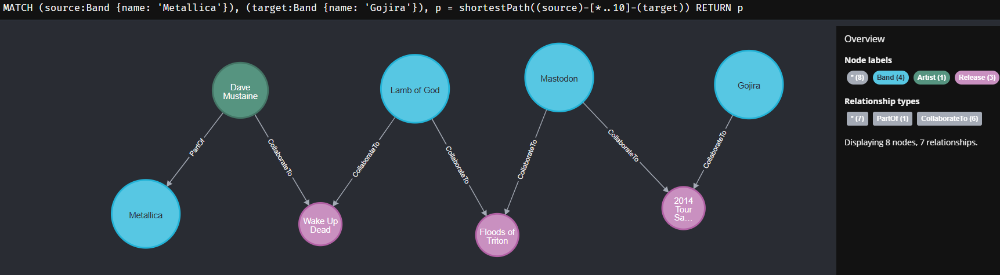
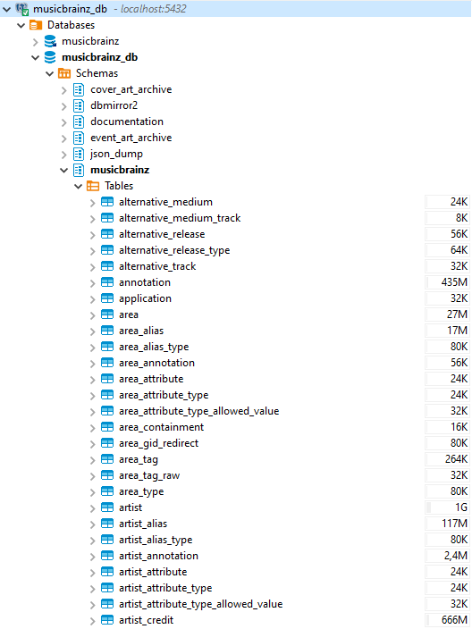
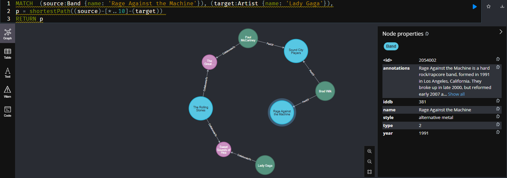
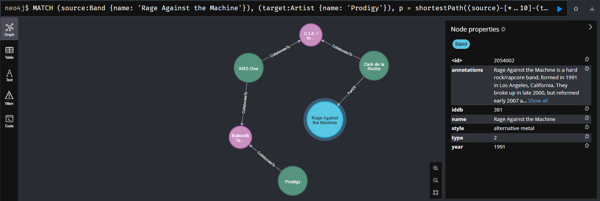
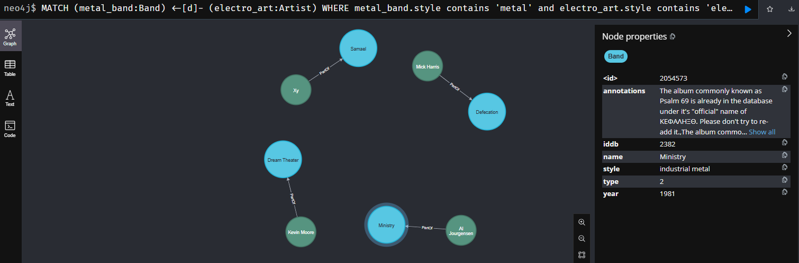
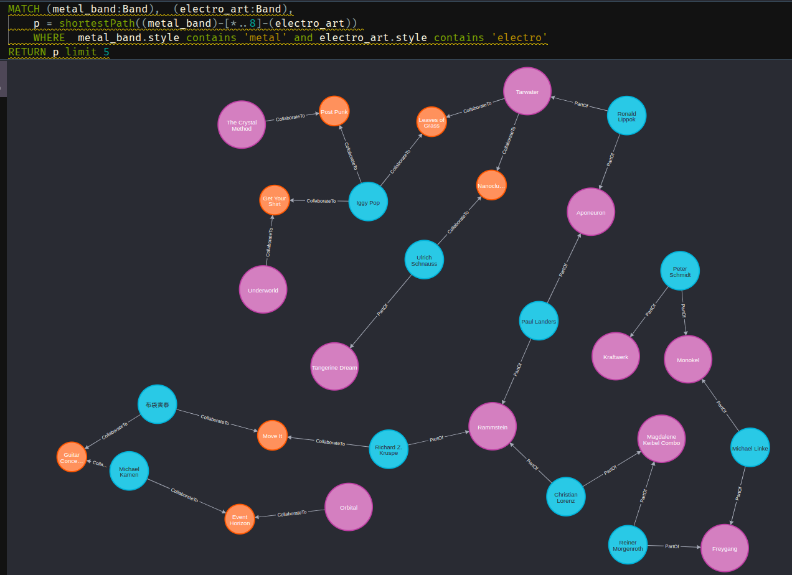
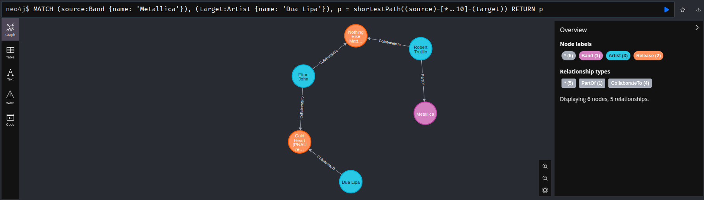

# Music Brainz to Neo4j

How Gojira and Metallica relates ?


See other data exploration at the end ! 

## Goals
https://musicbrainz.org/ is an open music encyclopedia that collects music metadata and makes it available to the public. 
The goal of this repo is to make available some of its data into a neo4j database abd then ask typical graph questions (shortest path ,...) and discover new bands or artists.

Only a part of the database is used : 
* Artists (single person)
* Bands (in the same table but having a type = 2)
* Release and artists_credits especially when multiple artists are credited

See the full details of the database here : https://musicbrainz.org/doc/MusicBrainz_Database/Schema

## Pre requesites

* Docker
* Python
* Git
* 70 GB (40GB database + few GB for neo4j graph)
* 16 GB RAM

### Brainz Docker

You need to make available the database. The musicbrainz propose multiple ways. I think the simpler is to use the docker way.

https://musicbrainz.org/doc/MusicBrainz_Database/Download

#### Clone the repo

```bash
 git clone https://github.com/metabrainz/musicbrainz-docker
 cd musicbrainz-docker
 admin/configure with alt-db-only-mirror
 ```
 The last line set up the docker to start only database related service (no web server)

#### Edit the compose file to publish the port to the host

We will use the database from the host server so you may replace the *expose* keyword by the *port*

See https://stackoverflow.com/questions/40801772/what-is-the-difference-between-ports-and-expose-in-docker-compose

    expose:             -->    port:
      - "5432"          -->        - "5432"

#### Build

```bash
docker-compose build
```

### Neo4j server

Using the default latest and no auth 
This binds two ports (7474 and 7687) for HTTP and Bolt access to the Neo4j API. 
A volume is bound to /data to allow the database to be persisted outside the container.


```bash
docker run -d --env=NEO4J_AUTH=none    --publish=7474:7474 --publish=7687:7687     --volume=$HOME/neo4j/data:/data     neo4j
```

### Testings

Either you may work on your local machine or using a remote server, the example below will use the 'localhost' as target for services. If you are runing the server on a remote machine, you may set up an *ssh tunnel* to make the services ports reachable locally. eg :

```bash
ssh -L 5432:localhost:5432  -L 7687:localhost:7687  -L 7474:localhost:7474  <server IP>
```

#### Postgresql
Use a database browser to check database access. You can use an equivalent of the following jdbc url : 

jdbc:postgresql://localhost:5432/musicbrainz_db

The default password is 'musicbrainz'


__Additionnal views__

These views help getting the tags for artists mainly 

````sql
create view musicbrainz.v_grp_artist as
select  a.id as artistid,  a.name as  atristname, a.type as artisttype, grp.id as grpid, grp."name" as grpname, grp.type as grptype, a.begin_date_year as art_st, grp.begin_date_year as grp_st, laa.entity0_credit  , laa.entity1_credit  
from artist a 
join l_artist_artist laa on a.id = laa.entity0 
join artist grp on grp.id = laa.entity1

create view musicbrainz.v_tag_artist as
select a.id as artistid,  a.name as  atristname,t.id as tagid, t."name"  as tag, at2.count,  t.ref_count
from artist a 
join artist_tag at2 on a.id = at2.artist 
join tag t on at2.tag =t.id 
where t.ref_count > 10000
order by a.id, at2.count desc

create view musicbrainz.v_tag_artist_single as
select a.artistid , a.atristname , a.tagid, a.tag
FROM  musicbrainz.v_tag_artist a
 JOIN (
    SELECT artistid, MAX(count) count
    FROM  musicbrainz.v_tag_artist
    GROUP BY artistid
) b ON a.artistid = b.artistid AND a.count = b.count
  JOIN (
    SELECT artistid, MAX(ref_count) ref_count
    FROM  musicbrainz.v_tag_artist
    GROUP BY artistid, count
) c ON a.artistid = c.artistid AND a.ref_count = c.ref_count
order by 1
````


#### Neo4j

Test the access using for example 
http://localhost:7474/browser/


## Importer

### Venv and module

```bash
python -m venv ./venv
. ./venv/bin/activate
pip install neo4j
pip install py2neopy2neo
pip install psycopg2-binary
```

### Neo4j indexes

As we will use initial database IDs for refering to the neo4j objects, they need to be indexed :  

```sql
CREATE INDEX IDXartiddb
FOR (n:Artist)
ON (n.iddb)

CREATE INDEX IDXbandiddb
FOR (n:Band)
ON (n.iddb)

CREATE INDEX IDXReliddb
FOR (n:Release)
ON (n.iddb)
```


### Runing the code

Note you may clean up the neo4j database first if it has been use for previsou testings 

```sql
MATCH (n)
WITH n LIMIT 100000
DETACH DELETE n
RETURN count(*);
```
Once the venv activated, you can run (in my computer it took 3min approx for importing 2.4M objects): 

```bash
time python -u ./importMBToNeo.py
2025-01-03 12:43:47,905 WARNING Config loaded
2025-01-03 12:43:47,928 WARNING Working on Artist
2025-01-03 12:43:47,928 INFO SQL select a.id, a.name, a.sort_name, a.begin_date_year, a.type, a.gender, a.comment, ts.tag , string_agg(a2.text, ',') as annotations from  musicbrainz.artist a  left join  musicbrainz.v_tag_artist_single ts on a.id = ts.artistid left join artist_annotation aa on  a.id = aa.artist left join annotation a2 on a2.id  = aa.annotation where a.type = 4 or a.type = 1 or a.type is null group by a.id, a.name, a.sort_name, a.begin_date_year, a.type, a.gender, a.comment, ts.tag
2025-01-03 12:43:53,674 WARNING Number of objects fetched 1893896
2025-01-03 12:43:55,191 INFO Batch insert node 0 remaining 1893896
2025-01-03 12:43:55,912 INFO Batch insert node 20000 remaining 1873896
..........
27.53user 2.03system 2:51.45elapsed 17%CPU (0avgtext+0avgdata 1079876maxresident)k
4232inputs+448outputs (27major+598351minor)pagefaults 0swaps

```
### Testing & Playing

__Rage Against the Machine to Lady Gaga !__



```sql
MATCH  (source:Band {name: 'Rage Against the Machine'}), (target:Artist {name: 'Lady Gaga'}),
p = shortestPath((source)-[*..10]-(target)) 
RETURN p
```

__Motorhead to Helloween__



```sql
MATCH  (source:Band {name: 'Helloween'}), (target:Band {name: 'Motörhead'}),
p = shortestPath((source)-[*..10]-(target)) 
RETURN p
```


__Pioneers in Industrial Metal__
 Here searched as having an 'electro' style musician in a metal band!)



```sql
MATCH (metal_band:Band) <-[d]- (electro_art:Artist)
WHERE  metal_band.style contains 'metal' 
                and electro_art.style contains 'electro'
                        and metal_band.year < 1990
RETURN metal_band, d, electro_art
limit 50
```

__Exploring metal and electronic music band relations__



```sql
MATCH (metal_band:Band),  (electro_art:Band),
    p = shortestPath((metal_band)-[*..8]-(electro_art)) 
    WHERE  metal_band.style contains 'metal' and electro_art.style contains 'electro'
RETURN p limit 5
```


__Metallica To Dua Lipa__



```sql
MATCH  (source:Band {name: 'Metallica'}), (target:Band {name: 'Justice'}),
p = shortestPath((source)-[*..10]-(target)) 
RETURN p
```