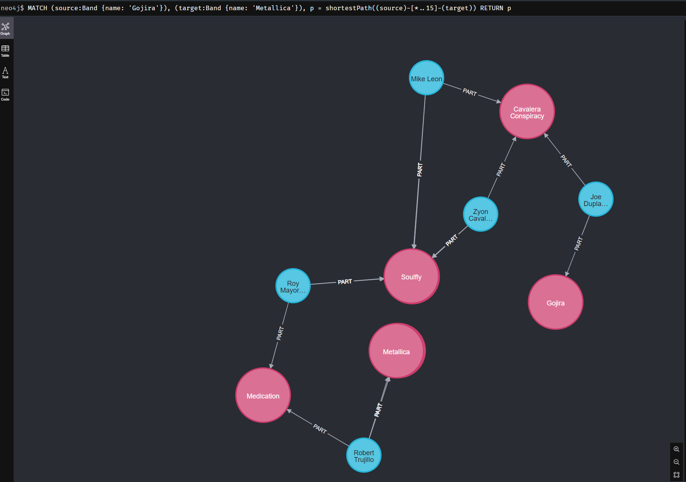

# Music Brainz to Neo4j


How Gojira and Metallica relates ?

## Goals
https://musicbrainz.org/ is an open music encyclopedia that collects music metadata and makes it available to the public.


## Pre requesites

* Docker
* Python
* Git

### Brainz Docker

You need to make available the database. The musicbrainz propose multiple ways. I think the simpler is to use the docker way.

https://musicbrainz.org/doc/MusicBrainz_Database/Download

#### Clone the repo

```bash
 git clone https://github.com/metabrainz/musicbrainz-docker
 cd musicbrainz-docker
 admin/configure with alt-db-only-mirror
 ```
 The last line set up the docker to start only database related service (no web server)

#### Edit the compose file to publish the port to the host

We will use the database from the host server so you may replace the 'expose' keyword by the 'port'

See https://stackoverflow.com/questions/40801772/what-is-the-difference-between-ports-and-expose-in-docker-compose

    expose:             -->    port:
      - "5432"          -->        - "5432"

#### Build

```bash
docker-compose build
```

### Neo4j server

Using the default latest and no auth 
This binds two ports (7474 and 7687) for HTTP and Bolt access to the Neo4j API. 
A volume is bound to /data to allow the database to be persisted outside the container.


```bash
docker run -d --env=NEO4J_AUTH=none    --publish=7474:7474 --publish=7687:7687     --volume=$HOME/neo4j/data:/data     neo4j
```

### Testings

Either you may work on your local machine or using a remote server, the example below will use the 'localhost' as target for services. If you are runing the server on a remote machine, you may set up an ssh tunnel to make the services ports reachable locally. eg :

```bash
ssh -L 5432:localhost:5432  -L 7687:localhost:7687  -L 7474:localhost:7474  192.168.1.3
```

## Importer

### Venv and module

* pip install neo4j
* pip install py2neopy2neo
* pip install psycopg2-binary


MATCH (n) DETACH DELETE n

MATCH (n)
WITH n LIMIT 100000
DETACH DELETE n
RETURN count(*);


CREATE INDEX IDXartiddb
FOR (n:Artist)
ON (n.iddb)


CREATE INDEX IDXbandiddb
FOR (n:Band)
ON (n.iddb)


MATCH (people:Artist)
RETURN people
LIMIT 5


MATCH (starrtInEighties:Artist)
WHERE starrtInEighties.begin_date_year >= 1980 AND starrtInEighties.begin_date_year < 1990
RETURN starrtInEighties.name as name, starrtInEighties.begin_date_year as begin_date_year
ORDER BY begin_date_year DESC

MATCH (starrtInEighties:Artist) -[d]-> (p:Band)
WHERE starrtInEighties.begin_date_year >= 1980 AND starrtInEighties.begin_date_year < 1990
RETURN starrtInEighties, d, p
limit 50


MATCH (myBand:Band) <-[d]- (p:Artist)
WHERE myBand.name = 'Gojira'
RETURN myBand, d, p
limit 50


MATCH (myBand:Band) <-[d]- (p:Artist)
WHERE myBand.name = 'Ultra Vomit'
RETURN myBand, d, p
limit 50

MATCH (myBand:Band) <-[d]- (p:Artist)
WHERE myBand.name = 'Metallica'
RETURN myBand, d, p
limit 50


MATCH (metal_band:Band) <-[d]- (p:Artist)
WHERE  metal_band.style contains 'metal'
RETURN metal_band, d, p
limit 500

MATCH (m:Group {name: 'In Flames'})<-[d]-(p:Artist)
RETURN m,d,p


MATCH  (source:Band {name: 'Ultra Vomit'}), (target:Band {name: 'Metallica'}),
p = shortestPath((source)-[*..15]-(target)) 
RETURN p

MATCH  (source:Band {name: 'Dark Tranquillity'}), (target:Band {name: 'In Flames'}),
p = shortestPath((source)-[*..25]-(target)) 
RETURN p
